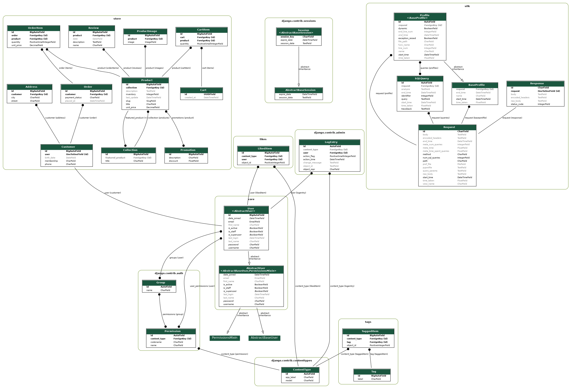

# ShoppingCart-Artifact-India-

# Lender-Portal
## Description

This project contains codeBase made for Artifact India for all shopping cart integration, financial calculations related implementation.

This includes ::

API Endpoints:
Create API views to handle ORM/CRUD operations - add, delete & update. These views will interact with your data model and incorporate business logic as needed.
Add basic authentication through HTTP header - static key check is okay

Use Django Rest Framework for building RESTful APIs if you are familiar with it. Otherwise, you can simulate RESTful API JSON responses with views or custom serializers. 
Adding JWT authentication and verification
Add necessary unittest to integration tests for API or business logic

Serializers
Create serializers for your models to convert complex data types (like Django models) to Python data types that can be rendered into JSON.

API Examples:
Add & Alter User Entry
Add & Alter Product Entry
Add & Alter Order Entry
Add & Alter Payment Entry
Other APIs would need to operate the application

Challenges faced and decisions made during the development process.

To explain each and every models.
To make it easier I have created a image of relationship between models.

***

***

Outlining the data and populating it.
Maintaning strict ordered code in terms of thinking models and shopping needs.
Including libraries to make it more better and robust such as :
    'corsheaders',
    'djoser',
    'silk',
    'debug_toolbar'
    'django_extensions',

Also putting out JWT.

# Django and Python Version for project.
    Django - 3.2.25
    Python - 3.6
    Django Rest Framework = 3.15.1

